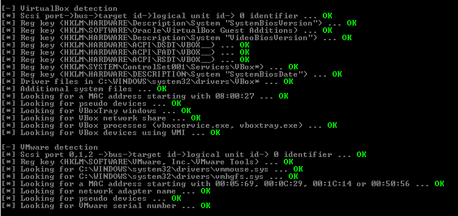
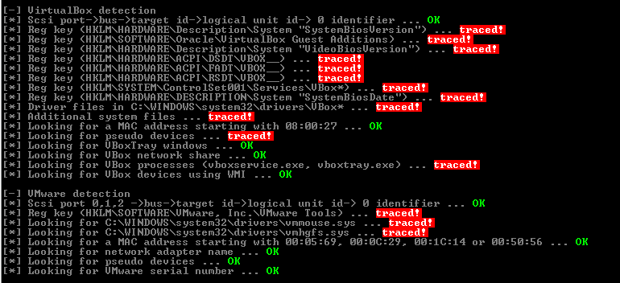
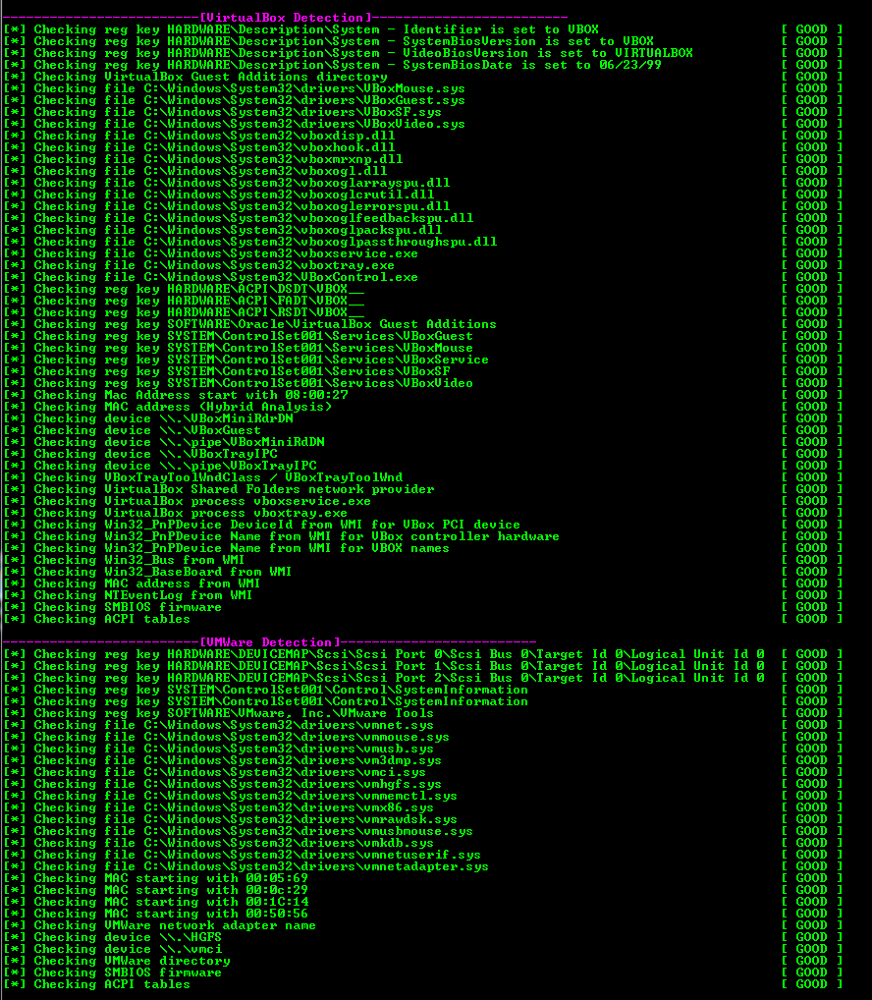
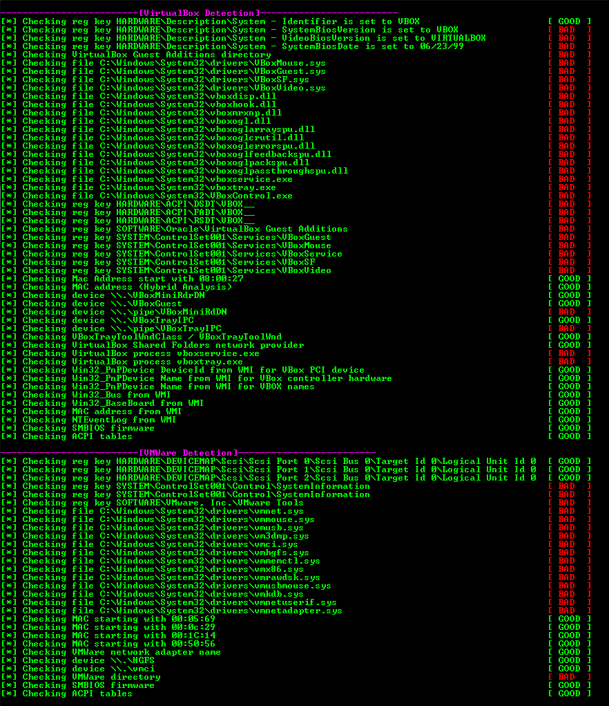

# Fake Sandbox Artifacts (FSA)

Inspired from the PowerShell script [Fake Sandbox Processes (FSP)](https://github.com/Phoenix1747/fake-sandbox/), this script allows you to create various artifacts on a bare-metal Windows computer in an attempt to trick malwares that looks for VM or analysis tools.

The names of the artifacts to be created are separated in text files in the different folders to allow easy modification.


## Background

It is estimated that 15-20% [[13]](#13) of malwares are aware of virtual machine environment and will either abort execution or change its behavior upon detection. Also, *fingerprinting tactic is still the dominant approach to evade sandboxes*. [[15]](#15)

## Features 

- Create dummy files, folders and registry entries used by virtualization softwares (VmWare,VirtualBox,Qemu,...) in guest operating systems 
- Spawns dummy processes with names related to analysis tools and sandbox environments
- Makes named pipes commonly used by virtual machines 
- Installs and start dummy services typically found after installing VMware Tools/VBox Guest Additions Service

### Usage
```bash
usage: fsa.py [options]:

Fake Sandbox Artifact is a script that helps you create artifacts related to malware analysis lab environment and
virtualization systems

optional arguments:
  -h, --help            show this help message and exit
  --registry            Creates artifacts in the registry. Requires elevated privileges
  --application         Creates files and folders specified in the text files. Requires elevated privileges
  --pipe {start,stop}   Starts the dummy pipe server (dummy_pipe.py)
  --process {start,stop}
                        Start the dummy processes
  --service {install,uninstall}
                        Install and start dummy services using dummy-win-service_x64.exe. Requires elevated privileges
```

## Testing against pafish and al-khaser

| [Pafish](https://github.com/a0rtega/pafish) - Before | [Pafish](https://github.com/a0rtega/pafish) - After running *fsa.py* |
|:-:|:-:|
|  |  |
| **[Al-khaser](https://github.com/LordNoteworthy/al-khaser) - Before** | **[Al-khaser](https://github.com/LordNoteworthy/al-khaser) - after running *fsa.py*** |
|  |  |

## Testing against malware samples

| Malware Name | SHA256 | Without FSA | With FSA | Notes | Conclusion |
| :-------------: |:-------------:|:-------------:|:-------------:|:-------------:|:-------------:|
| AgentTesla | [737ea6edfdc8fa560104c62e87efa44f0ec600dfda82f0ac09aa2d9f6fc522fa](https://bazaar.abuse.ch/sample/737ea6edfdc8fa560104c62e87efa44f0ec600dfda82f0ac09aa2d9f6fc522fa/) | Malware established persistance via the Windows scheduler | No malicious behaviors observed | dummy registry values modified the malware behavior | :heavy_check_mark: |

To be continued

## Limitations

For this script to trigger a positive fingerprinting from the malware sample, it has to know what constitutes the fingerprinting in the first place. However, the strategy here is simply to hit on many of those known checks as possible, hoping that at least one artifact will be detected.

Most advanced checks are looking for virtual hardware, memory or kernel hypervisor artifacts, which are harder to fake (e.g. Hardware IDs., loaded drivers/kernel objects).

------------

Successfully tested on the following bare-metal Windows versions:

- Windows 7 x64
- Windows 8.1 x64
- Windows 10 x64

## References
<a id="1">[1]</a> [Github - Public malware techniques used in the wild](https://github.com/LordNoteworthy/al-khaser)

<a id="2">[2]</a> [Github - Pafish](https://github.com/a0rtega/pafish)

<a id="3">[3]</a> [Gtihub - Anti-Sandbox and Anti-Virtual Machine Tool](https://github.com/AlicanAkyol/sems)

<a id="4">[4]</a> [Github - Evasion-Tools](https://github.com/atlantis2013/Evasion-Tools)

<a id="5">[5]</a> [Github - cuckoosandbox signatures](https://github.com/cuckoosandbox/community/tree/master/modules/signatures/windows)

<a id="6">[6]</a> [Github - Antivmdetection](https://github.com/nsmfoo/antivmdetection)

<a id="7">[7]</a> [Deep Instinct - Anti-Virtualization Malware](https://www.deepinstinct.com/2019/10/29/malware-evasion-techniques-part-2-anti-vm-blog/)

<a id="8">[8]</a> [Cyberbit - Anti-VM and Anti-Sandbox Explained](https://www.cyberbit.com/blog/endpoint-security/anti-vm-and-anti-sandbox-explained/)

<a id="9">[9]</a> [VinCSS Blog - GuLoader AntiVM Techniques](https://blog.vincss.net/2020/05/re014-guloader-antivm-techniques.html)

<a id="10">[10]</a> [Prodefence - Collection of Anti-Malware Analysis Tricks](https://www.prodefence.org/collection-anti-malware-analysis-tricks/)

<a id="11">[11]</a> [rvsec0n - Anti VM and Anti Sandbox techniques in Themida and VMProtect](https://rvsec0n.wordpress.com/2019/09/15/anti-vm-and-anti-sandbox-techniques-in-themida-and-vmprotect/)

<a id="12">[12]</a> [code13 Blog - anti-VM vmware](https://code13.tistory.com/145)

<a id="13">[13]</a> [Symantec - Internet Security Threat Report Volume 24 | February 2019](https://docs.broadcom.com/doc/istr-24-2019-en)

<a id="14">[14]</a> [University of Tsukuba - Trends of anti-analysis operations of malwares observed in API call logs](https://tsukuba.repo.nii.ac.jp/?action=pages_view_main&active_action=repository_view_main_item_detail&item_id=46267&item_no=1&page_id=13&block_id=83)

<a id="15">[15]</a> [ Amirkabir University of Technology - Malware Dynamic Analysis Evasion Techniques: A Survey](https://arxiv.org/pdf/1811.01190.pdf)
